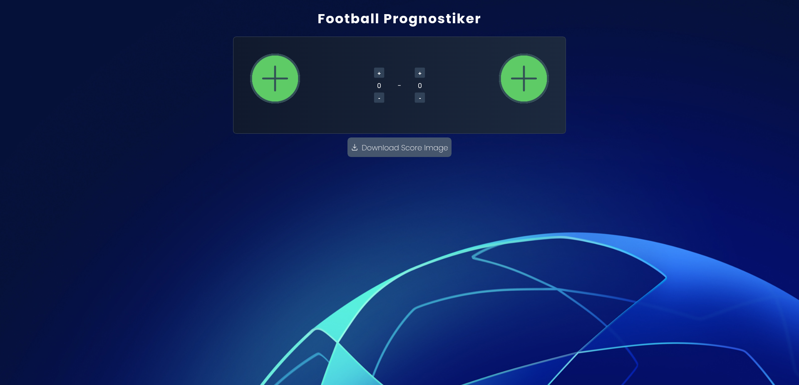

# Football Prognostic Faking app

## App

## About

Implement an application that will be able to produce fake football match scores.

Use this JSON repository for the flags: https://github.com/gilons/prognostiker/blob/master/src/meta/football.json

- The initial page should be a page that shows the score template precisely the way it will look once the user exports it as an image.

Example: https://drive.google.com/file/d/1e6is-YuOjDK9fuOfrXnYIZe50eBJZ1DK/view?usp=sharing

- There should be one page/modal to display the list of flags and the names of the team organized by countries and clubs from which the user can select the flag.

After the user enters the flag and scores for both opponents he should be able to capture the image and download it.

## User Flow

1. User enters Flag and scores for both teams
2. After that is done, user is able to capture the image and download it

## Built With

- ReactJS
- html2canvas
- npm
- vercel
- react-icons
- downloadjs

### Prerequisites

Knowledge about JS, ReactJS, Ky, npm, vite, Zustand and tailwindcss

- Basic data structures
- Arrays
- useEffect
- Functions
- objects
- useState
- json

## Clone Project

- To get a local copy up and running follow these simple example steps.
- Clone this repository with `git@github.com:Chu29/football-prognostic-faking-app.git` using your terminal or command line.
- Change to the project directory by entering: `cd football-prognostic-faking-app` in the terminal.

## Command line steps

- $ git clone `git@github.com:Chu29/football-prognostic-faking-app.git`
- $ `cd football-prognostic-faking-app`
- $ `git checkout development`

## Start App

- run `npm install`
- run `npm run dev` in your command line

## Live Site

[Link](https://football-prognostic-faking-app.vercel.app/)

## Author

**MUEGHE ABUEMKEZE CHU**

- GitHub: [@Chu29](https://github.com/Chu29)
- Twitter: [@chu_codes](https://x.com/unku_chu)
- LinkedIn: [Chu Abuemkeze M.K](https://www.linkedin.com/in/chu-abuemkeze/)
